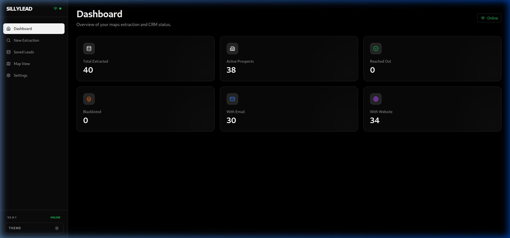
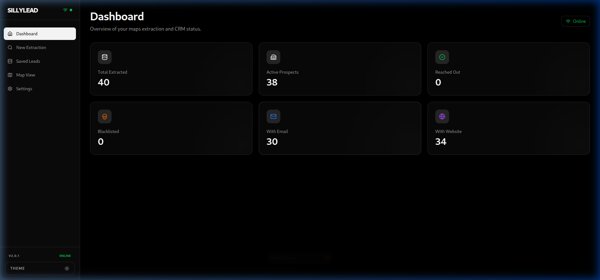
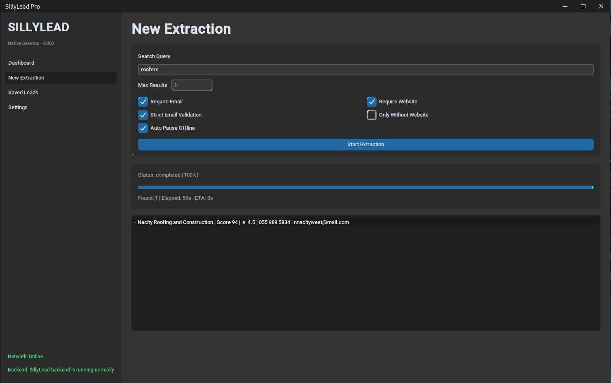
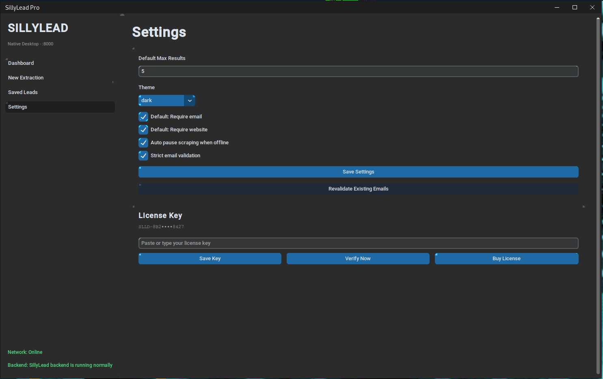

# SillyLead Demo Gallery

This page provides visual proof of the real SillyLead product interfaces.

All images below come directly from:
- `assets/demo/` in this repository
- `public/demo/` in `sillylead-web`

## Live Demo Capture

  

## Core Web/Desktop Workflow

### Scraper

  
  

### Dashboard + CRM + Map

  
  
  

  

## Native Desktop GUI Screens

  
  

  
  

## Why this page exists

- Give buyers confidence before payment.
- Show real UI and scraping workflow evidence.
- Keep visual evidence versioned with releases.

