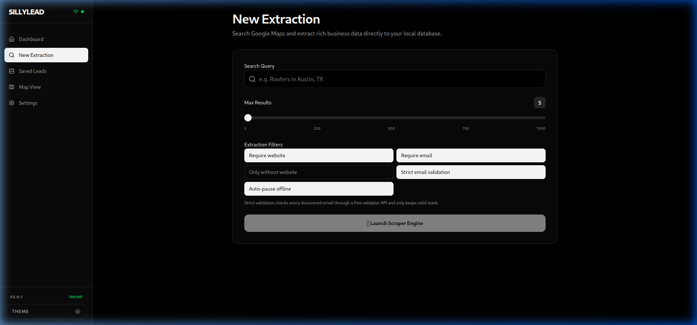
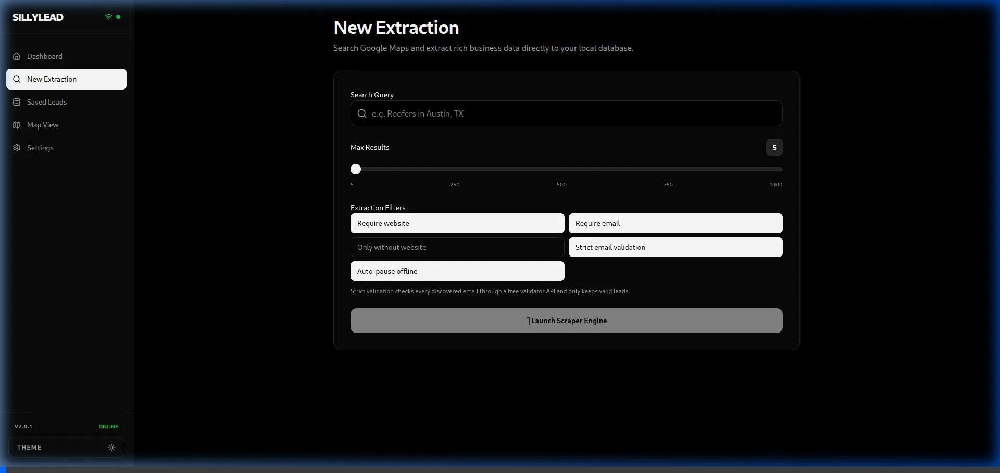
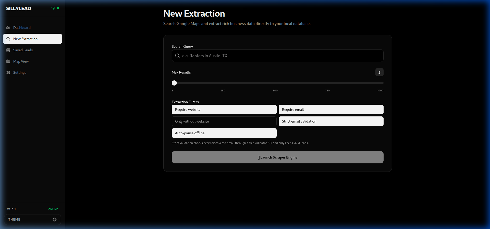
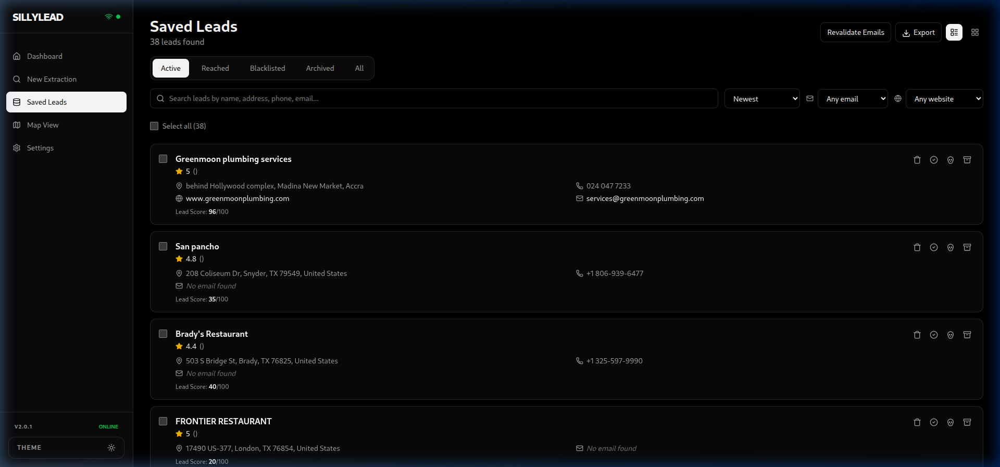
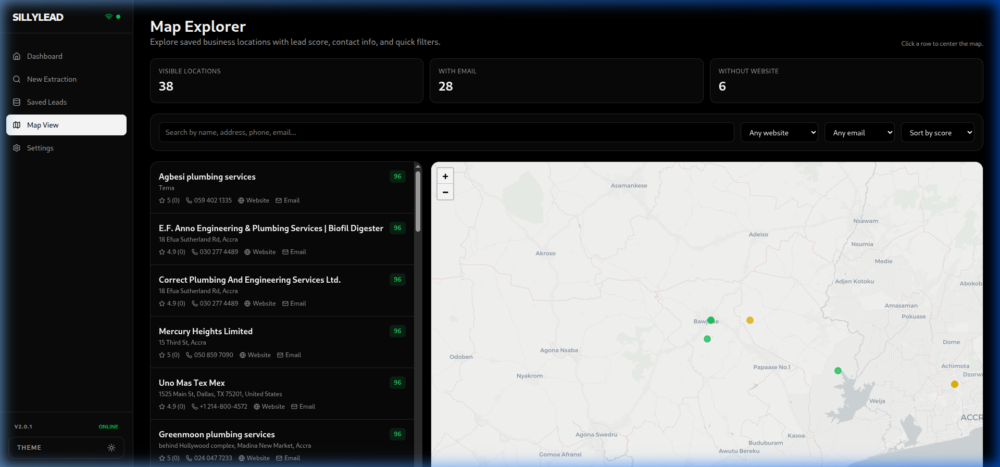
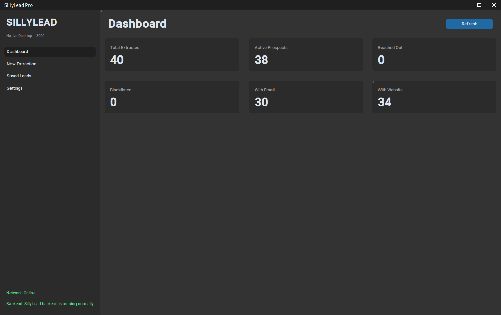
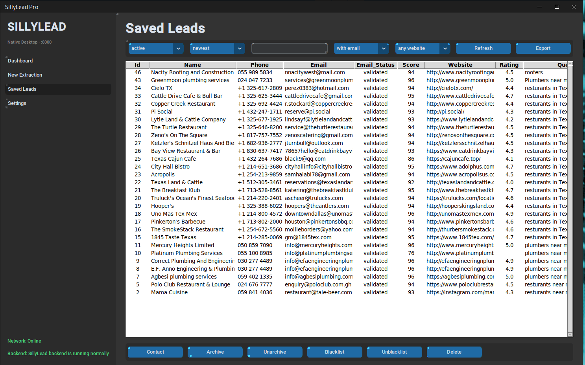

# SillyLead Downloads Hub

<p align="center">
  
</p>

This folder is the distribution source for SillyLead installers and update metadata.

It is designed for two things:
1. End users install the app from here.
2. Installed apps check this source for updates.

Main website (license purchase and product page): **https://sillylead.vercel.app**

Current public release: **v2.1.0**

## Product Proof (Screens + Live Capture)

These files are real captures from the running SillyLead application and desktop GUI.

- Full gallery: [`DEMO_GALLERY.md`](./DEMO_GALLERY.md)
- Website demo assets mirror: `sillylead-web/public/demo/`

<p align="center">
  
</p>

<p align="center">
  
  
  
</p>

<p align="center">
  
  
  
</p>

## What This Folder Contains

- `install.py`
  - Cross-platform bootstrap installer.
  - Runs system checks and downloads the correct build for the user.
  - Reads `latest.json` to know which file to download.

- `latest.json`
  - Source of truth for the current version and per-OS download URLs.
  - Used by both the installer and the app's in-app update checker.

- Release binaries/installers
  - Files generated from the CI/CD build workflow (Windows, macOS, Linux, Android).

- `SETUP_GUIDE.md`
  - End-user setup instructions.

- `DEMO_GALLERY.md`
  - Proof gallery with real screenshots and interface captures.

- `UPLOAD_AND_NAMING.md`
  - Maintainer guide for upload steps and naming rules.

## Installation For Users

### Option A: Quick installer script

```bash
curl -sL https://raw.githubusercontent.com/mma-k/SillyLead-Downloads/main/install.py | python3
```

### Option B: Manual download

1. Open `latest.json`.
2. Copy the URL for your OS under `assets`.
3. Download and run that installer/binary.

## Update System

SillyLead checks for updates from this downloads source in this order:

1. `latest.json` from `main` branch.
2. `latest.json` from `master` branch (fallback).
3. GitHub `releases/latest` API (fallback).

When a new version is found:
- The app shows the new version.
- It shows the exact download/update path.
- It keeps user data safe because DB/config/license are stored in app-data directories, not inside the installer binary.

## Data Safety During Updates

Updates do not overwrite user data files. These are stored outside the app binary:

- Windows: `%APPDATA%/SillyLead/`
- macOS: `~/Library/Application Support/SillyLead/`
- Linux: `~/.config/sillylead/`

Important files:
- `sillylead.db`
- `.env`
- `sillylead.lic`
- `config.json`

## Maintainer Workflow

1. Build installers from the main project CI (`.github/workflows/build.yml`).
2. Upload installer files to the downloads release/location.
3. Update `latest.json` with:
   - new `version`
   - new per-platform `download_url`
   - optional release notes
4. Commit/push `latest.json`.
5. Verify with:
   - `python3 install.py`
   - launching existing app and confirming update prompt appears.

Full step-by-step details: see `UPLOAD_AND_NAMING.md`.

## License Purchase Link

All docs and app messages should point users to:

**https://sillylead.vercel.app**
