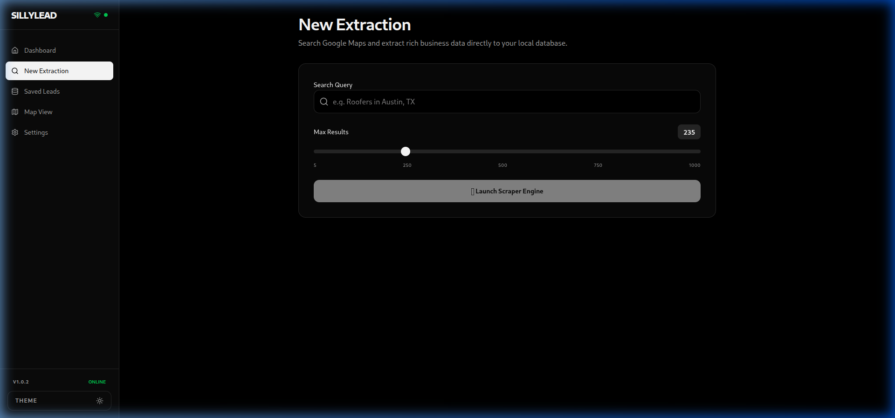
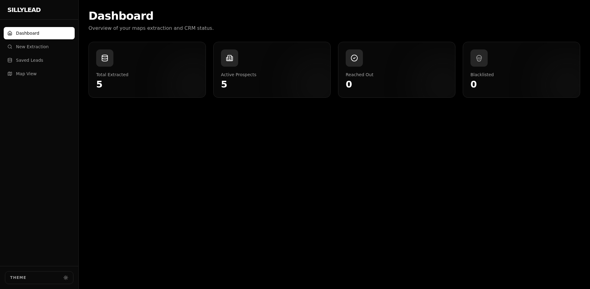
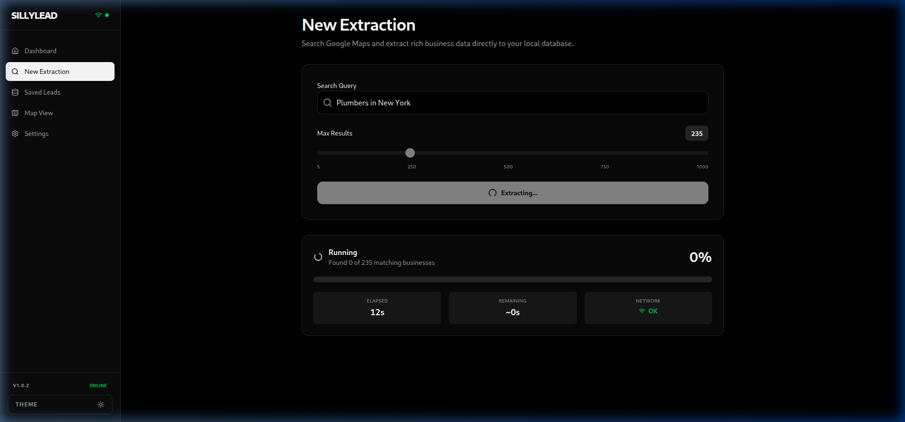
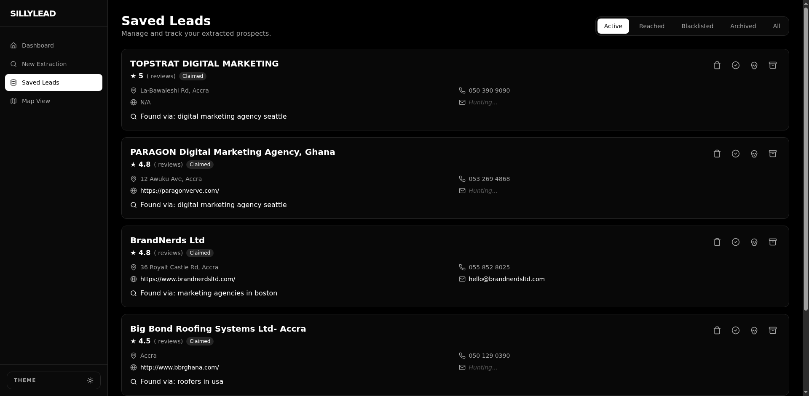
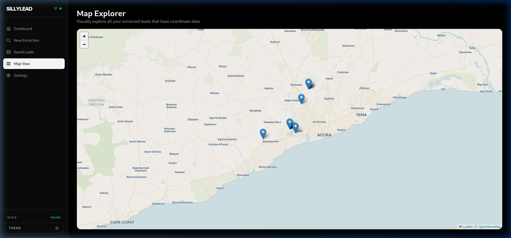
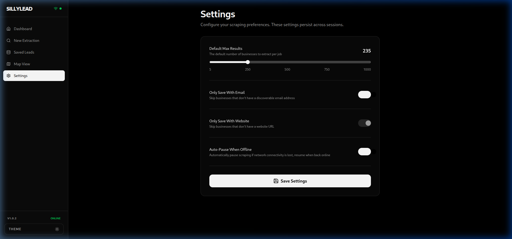

<div align="center">

# SillyLead Pro — Setup Guide 🛠️

**A step-by-step visual guide for getting SillyLead running on your computer.**
<br>
*No coding experience needed. Just follow the steps below.*

</div>

---

## Before You Start

You need **two things** to use SillyLead:

1. ✅ **Google Chrome** (or Chromium) installed on your computer
2. ✅ **A License Key** — contact us to get one (see bottom of this page)

That's it. No Python, Node.js, or any developer tools needed.

---

## Step 1: Download SillyLead

### Option A: Auto-Installer (Easiest)

If you already have Python installed, open your **Terminal** (Mac/Linux) or **Command Prompt** (Windows) and paste this one line:

```
curl -sL https://raw.githubusercontent.com/mma-k/SillyLead-Downloads/main/install.py | python3
```

This will:
- ✅ Check if your computer is ready
- ✅ Verify Chrome is installed
- ✅ Download the correct version for your OS
- ✅ Set it up for you



### Option B: Manual Download

Go to our releases page and download the file for your operating system:

| Your Computer | Download This |
|---------------|---------------|
| **Windows** | `windows-sillylead.exe` |
| **Mac** | `macos-sillylead` |
| **Linux** | `linux-sillylead` |

📥 **Download here:** [github.com/mma-k/SillyLead-Downloads/releases](https://github.com/mma-k/SillyLead-Downloads/releases)

---

## Step 2: Install Google Chrome

> ⚠️ **This is required.** SillyLead uses Chrome in the background to extract data from Google Maps. Without it, the scraper won't work and you'll see an error.

### Windows
1. Go to [google.com/chrome](https://www.google.com/chrome/)
2. Click "Download Chrome"
3. Run the installer
4. Done!

### Mac
1. Go to [google.com/chrome](https://www.google.com/chrome/)
2. Click "Download Chrome"
3. Open the `.dmg` file and drag Chrome to your Applications folder
4. Done!

### Linux (Ubuntu/Debian)
Open your Terminal and type:
```
sudo apt update && sudo apt install chromium-browser
```

### How to Check If Chrome Is Already Installed
Open your Terminal or Command Prompt and type:
```
google-chrome --version
```
or
```
chromium --version
```
If you see a version number (like `Chromium 124.0.6367.155`), you're good!

---

## Step 3: Run SillyLead

### On Windows
1. Find the `windows-sillylead.exe` file you downloaded
2. **Double-click** it
3. If Windows shows a blue warning ("Windows protected your PC"), click **"More info"** → **"Run anyway"**
4. A terminal window will open — SillyLead is starting! 🎉

### On Mac
1. Open **Terminal** (search for it in Spotlight)
2. Navigate to where you downloaded the file:
   ```
   cd ~/Downloads
   ```
3. Make it executable:
   ```
   chmod +x macos-sillylead
   ```
4. Run it:
   ```
   ./macos-sillylead
   ```
5. If macOS blocks it: Go to **System Preferences → Security & Privacy** → Click **"Open Anyway"**

### On Linux
1. Open your **Terminal**
2. Navigate to the download folder:
   ```
   cd ~/Downloads
   ```
3. Make it executable and run:
   ```
   chmod +x linux-sillylead
   ./linux-sillylead
   ```

---

## Step 4: Enter Your License Key

On your **first launch**, SillyLead will ask:

```
⚠ No license found.
Enter your SillyLead License Key:
```

Type or paste the license key you received (it looks like `SLL-XXXX-XXXX-XXXX`) and press Enter.

- Your license is **permanently tied to your computer** — it only works on this device
- After activating once, you won't be asked again (even offline!)

### 💡 Pro Tip: Skip the Prompt Every Time

Create a small text file called `.env` in the **same folder** as the SillyLead executable. Inside it, put:

```
SILLYLEAD_LICENSE_KEY=SLL-XXXX-XXXX-XXXX
```

Replace `SLL-XXXX-XXXX-XXXX` with your actual key. Now SillyLead will activate automatically every time!

---

## Step 5: Start Using SillyLead

After activation, SillyLead opens your browser to the **Dashboard**:



### 🔍 Search for Businesses
Click **"New Extraction"** in the sidebar → Type your search (like "Plumbers in Houston TX") → Click **"Launch Scraper Engine"**



Watch as businesses are found in real-time with a progress bar!

### 📋 View Your Leads
Click **"Saved Leads"** to see all extracted businesses with their name, phone, email, website, address, and rating.



### 🗺️ Map View
Click **"Map View"** to see all your leads plotted on an interactive map.



### ⚙️ Settings
Click **"Settings"** to configure your preferences — default max results, email/website filters, and offline behavior.



---

## Common Issues & Fixes

| What You See | What To Do |
|-------------|------------|
| **"session not created: ChromeDriver version mismatch"** | Your Chrome browser is outdated. Update it to the latest version. |
| **"No license found"** | Enter your license key. If you don't have one, contact us below. |
| **"License already activated on another device"** | Each key works on ONE device only. Contact us to unbind your old device. |
| **Tool seems slow** | Make sure your internet connection is stable. Close other heavy apps. |
| **Windows blocks the .exe** | Click "More info" → "Run anyway". This is normal for unsigned apps. |
| **Mac/Linux: "permission denied"** | Run `chmod +x sillylead` first to make the file executable. |

---

## 📧 Get Your License Key

Interested in SillyLead Pro? Reach out to us:

| Method | Contact |
|--------|---------|
| 📱 **WhatsApp / Text** | **+233 509 954 835** *(text only, no calls please)* |
| 📧 **Email** | **muhidtech1@gmail.com** |

> Send us a message saying you're interested in SillyLead and we'll set you up with a license key.

---

<div align="center">
<b>SillyLead Pro v1.02</b> · Built for serious lead generation
<br>
<i>No coding required. Just download, activate, and start scraping.</i>
</div>
